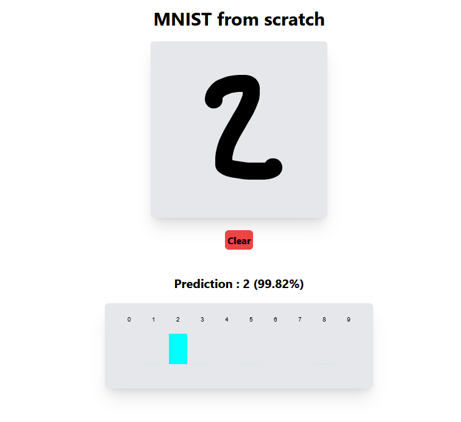

    <h1><code>`mnist-from-scratch`</code></h1>
    <i>A handwritten digit classsifier neural network written and trained from scratch in pure zig</i>
     
    Uses <code>brainz</code> library for model training.
    

## Getting it up running

This requires Zig **0.13.0** to work.

1. Clone the git repository
2. Download and extract the MNIST dataset into the repository root.
2. Run `zig build` and wait for model training to finish (should take approximately 5-10min)
3. Deployable WASM + HTML file is at `zig-out/web/public`

## License and acknowledgements

This project is licensed under **MIT licence**.

Uses the MNIST dataset (https://yann.lecun.com/exdb/mnist/)

